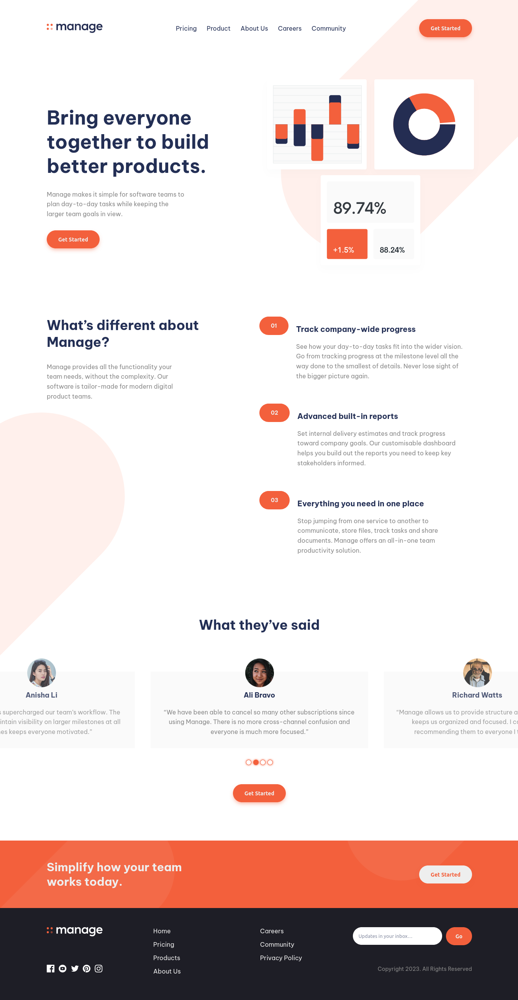

# Frontend Mentor - Manage landing page solution

This is a solution to the [Manage landing page challenge on Frontend Mentor](https://www.frontendmentor.io/challenges/manage-landing-page-SLXqC6P5). Frontend Mentor challenges help you improve your coding skills by building realistic projects.

## Table of contents

- [Overview](#overview)
  - [The challenge](#the-challenge)
  - [Screenshot](#screenshot)
  - [Links](#links)
- [My process](#my-process)
  - [Built with](#built-with)
- [Author](#author)
- [Acknowledgments](#acknowledgments)

## Overview

### The challenge

Users should be able to:

- View the optimal layout for the site depending on their device's screen size
- See hover states for all interactive elements on the page
- See all testimonials in a horizontal slider
- Receive an error message when the newsletter sign up `form` is submitted if:
  - The `input` field is empty
  - The email address is not formatted correctly

### Screenshot

Note that some sections don't show case it show when scroll

### Links

- Solution URL: [solution URL here](https://github.com/Jalal-Aljhny/Manage-landing-page)
- Live Site URL: [live site URL here](https://jalal-aljhny.github.io/Manage-landing-page/)

## My process

### Built with

- Semantic HTML5 markup
- CSS custom properties
- Flexbox
- sass
- javascript

## Author

- GitHub - [Jalal Aljhny](https://github.com/Jalal-Aljhny)
- Frontend Mentor - [@Jalal Aljhny](https://www.frontendmentor.io/profile/Jalal-Aljhny)

